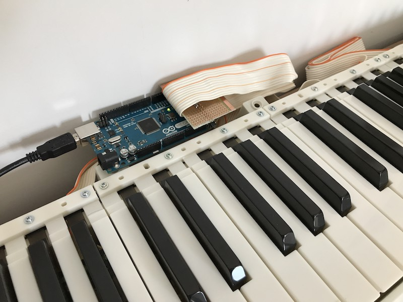
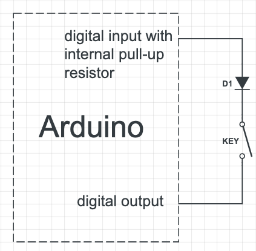
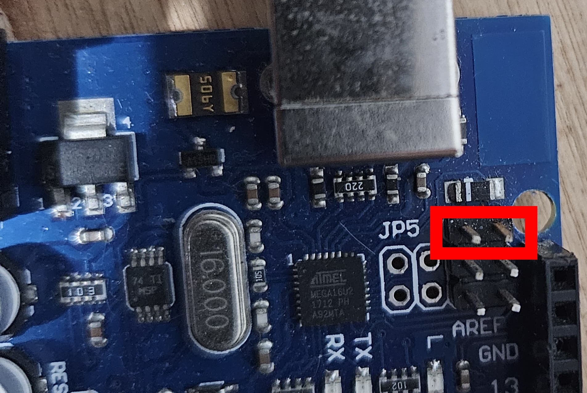

# Moura's Keyboard Scanner

Turn your broken (or unused) keyboard into a MIDI controller

This Arduino sketch was the one that I used to make the project demonstrated
in [this](https://www.youtube.com/watch?v=z840N9P-T2k) video.
It is about a keyboard controller that I've made using an old Alesis QS6 Keyboard
directly connected to an Arduino Mega rev3 acting as keyboard scanner with
velocity reading and sustain pedal support.

In 2017 I did the same with another keyboard (an old Casio from a friend).
The code was refactored and a great library called [DIO2](https://github.com/FryDay/DIO2)
was used to speed up the scanning and clean up the old code.

In 2020, thanks to Leandro Meucchi, from Argentina, the code improved to be used with any keyboard.
He made the PDF showing the keyboard wiring for Yamaha PSR530 keyboard, that helps a lot to understand what needs to be done.

In 2025 Emerson Seiler did a great job adding Kurzweil SP76II configuration + schematics, velocity sensitivity curves and potentiomers support, as he shows [here](https://www.youtube.com/watch?v=GndR5BkHnv0). He also suggested to explode the code into small pieces.

I started 2026 working on top Emerson Seiler's job as an opportunity to do a refactoring, creating the concept of "models" and merging his code into the main line.

## Features

- Sustain pedal
- Velocity sensitivity with curves support
- Potentiometers

## How velocity works

Normally it is a ribbon rubber with two contacts for each key that touch the board in two diffent moments:
since the key was pressed until it slopes the board completly. The code measure the difference, varying between
2 and 120 ms, depending on the keyboard. It is transformed in a MIDI value from 0 to 127.

## Diagram of one rubber key

This scheme makes clear how to identify input and output pins. This has been the main question of guys on Youtube.
I hope it helps:

## How to make your own MIDI controller

1. Disassemble the keyboard to have access to the flat cables (one, two or even three, depending on the number of keys and manufacturer);
2. Using a multimeter with the diode testing function selected, find out and understand the matrix, starting from the first key. Some keyboards have a logical pattern, some doesn't;
3. Connect the ribbon pins **directly** to the Arduino Mega (because it has enough pins to connect any keyboard with velocity). You **dont't** need to change anything in the keyboard circuit board;
4. Duplicate one of the existing models and change the pins in the model.h (output_pins + input_pins), uncomment DEBUG_MIDI_MESSAGE in globals.h and see the console output;
5. If the MIDI messages looks OK, comment DEBUG_MIDI_MESSAGE back and use some Serial<->MIDI Bridge like the excelent [Hairless](https://projectgus.github.io/hairless-midiserial/);
6. If everything goes well, consider turn you Arduino in a MIDI interface using [HIDUINO](https://github.com/ddiakopoulos/hiduino) or similar firmware.
7. Enjoy!

## Converting an Arduino Mega into MIDI device

To convert the Arduino Mega into a MIDI device, I used the ability to modify the bootloader of the 16u2 chip.
NOTE: only Arduino Megas/Unos with this chip will work with this procedure.

- Using Homebrew I installed dfu-programmer

  `brew install dfu-programmer`

- Then download the dualMoco.hex file, which is a custom firmware that makes the 16u2 chip recognized as midi. It can be found in this project and also in [developers' github.](https://github.com/kuwatay/mocolufa/tree/master/HEX)
- It is important that serial communications are set to 31250 in the code to work.
- Connect the arduino mega and quickly short the first 2 pins with a jumper, then remove the jumper.
  
- Now in the terminal run the bootloader wipe
  `dfu-programmer atmega16u2 erase`
- Finally I installed dualMoco.hex
  `dfu-programmer atmega16u2 flash /Users/emerson/Downloads/dualMoco.hex`
- If you want to return to the original boot, repeat the previous steps but flash the original Mega/Uno bootloader.
  `dfu-programmer atmega16u2 flash /Users/emerson/Downloads/Arduino-usbserial-mega.hex`
- Perform a reset and remove and insert the ubs.
  `dfu-programmer atmega16u2 reset`
- Now the device will be recognized as a MIDI device.
- The files are available in the /bootloader folder.
- Make sure that SERIAL_SPEED in config.h is set to 31250.
