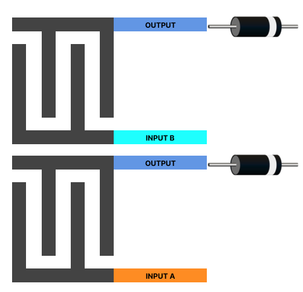
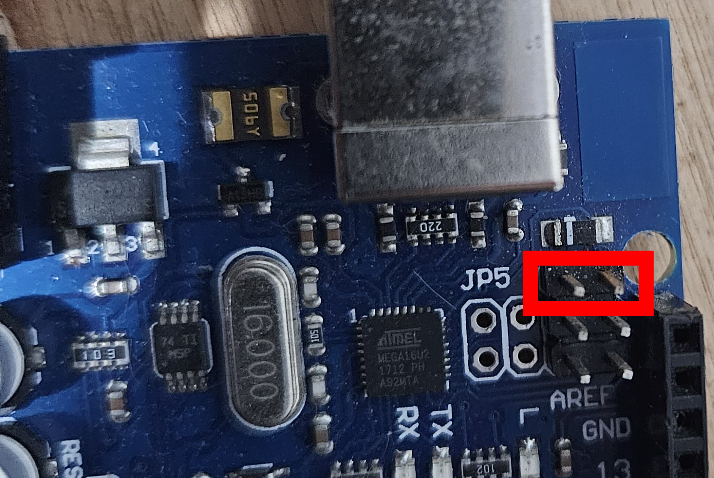

# Version

This version implements sensitivity curves and splits the code, it was built for the kurzweil sp76ii, but can be easily adapted to another keyboard.

## Source code

- code_tabs.ino:Main file for execution.
- config.h: Pin definitions and global constants, as well as key mapping and starting configurations.
- input.h: This code reads the state of several keys (or digital inputs) and a pedal in a loop, storing the results in the `signals` array, and counts how many read cycles happen per second if debugging is enabled.
- midi.h: This code sends a MIDI event adjusting the velocity of a note based on the input tempo, applying a specific correction for black keys and limiting the minimum and maximum values ​​allowed.
- states.h: This code updates the state of several keys (including presses, sustains, and releases) and sends appropriate MIDI events based on the input signal and key state, taking into account damper pedal usage.
- potentiometer.h: This code implements pitchbend, modulation and can add others, the code in this part needs more testing.

If you want to use only the controller functionality, simply configure the config.h file

## Key Mapping and Definition

A touch-sensitive keyboard matrix has inputs and outputs. In this project, I used a Kurzweil SP76II keyboard, which has a 16x20 matrix.
Each key consists of four contacts; the lower and upper contacts have Zener diodes (see the image below).
For proper operation, the diodes on all keys were reversed; the keyboard has 152 diodes. Some keyboards will not require this.

All the details of the pin mapping and the matrix are in the pdf [kurzweil_sp76ii.pdf](kurzweil_sp76ii.pdf)

In the config.h file, 36 pins were defined (PIN_CAx and PIN_CBx) using pins 18 to 53 of the Arduino Mega.
Looking at the matrix, we see that the keys are divided into groups, which can vary from keyboard to keyboard. On this keyboard, the groups are 8 keys, with 1 wire responsible for 8 keys.
At the top, each key has two wires, and these wires are obviously connected to other keys to form the matrix.
Now the mapping becomes simple. In the config.h file, look for output_pins and input_pins within the object and define the pins for each wire coming out of each key.

- The inputs (input_pins) are the wires that are not connected to a diode.
- The output pins are the wires that are directly connected to the diodes
- In the code, each key must be represented by 2 output_pins and 2 input_pins. In this context, my E1 (Mi 1 - first key) was:

  `byte output_pins[] =  {
PIN_CA9, //E1
PIN_CA9, //E1
}`

  `byte input_pins[] = {
  PIN_CA1,
  PIN_CA2,
  }`

- If the diodes in your matrix are in a different configuration, the inputs may need to be swapped for the outputs and vice versa.

## SENSITIVITY CURVE

Four methods have been added for calculating the sensitivity curve (config.h).
By default, the concave curve is selected; I liked its performance.
It is essential to calibrate MIN_TIME_MS and MAX_TIME_MS. To do this, you need to:

- 1 - Leave SERIAL_SPEED at 115200
- 2 - Uncomment DEBUG_VELOCITY
- 3 - Compile the code and open the serial monitor
- 4 - Play Very softly and copy the relevant log excerpt.
- 5 - Tap Medium and copy the relevant log excerpt.
- 6 - Tap Strong and copy the relevant log excerpt.
- 7 - Play very loudly and copy the relevant log excerpt.
- 8 -After that, take the code along with the log divided by force and present it to an AI and ask it to calculate the ideal MIN_TIME_MS and MAX_TIME_MS:
  Analyze the keystroke timing and speed data provided below and calculate the optimal MIN_TIME_MS and MAX_TIME_MS for the given code.
- 9 - Finally, ask her to adjust the array of the curve used, based on the calculated MIN_TIME_MS and MAX_TIME_MS:
  Suggest a new smooth concave curve based on the MIN_TIME_MS and MAX_TIME_MS values.

## Converting Arduino Mega to MIDI

To convert the Arduino Mega into a MIDI device, I used the ability to modify the bootloader of the 16u2 chip.
NOTE: only Arduino Megas/Unos with this chip will work with this procedure.

- Using Homebrew I installed dfu-programmer

  brew install dfu-programmer

- Then download the dualMoco.hex file, which is a custom firmware that makes the 16u2 chip recognized as midi. It can be found in this project and also in [developers' github.](https://github.com/kuwatay/mocolufa/tree/master/HEX)
- It is important that serial communications are set to 31250 in the code to work.
- Connect the arduino mega and quickly short the first 2 pins with a jumper, then remove the jumper.
  
- Now in the terminal run the bootloader wipe
  `dfu-programmer atmega16u2 erase`
- Finally I installed dualMoco.hex
  `dfu-programmer atmega16u2 flash /Users/emerson/Downloads/dualMoco.hex`
- If you want to return to the original boot, repeat the previous steps but flash the original Mega/Uno bootloader.
  `dfu-programmer atmega16u2 flash /Users/emerson/Downloads/Arduino-usbserial-mega.hex`
- Perform a reset and remove and insert the ubs.
  `dfu-programmer atmega16u2 reset`
- Now the device will be recognized as a MIDI device.
- The files are available in the /bootloader folder.
- You must set Serial.begin(31250) to 31250 for the devices to recognize MIDI messages.

## OPERATION

To see the project in progress, visit [my YouTube channel](https://youtube.com/@emersonseiler?sub_confirmation=1)
